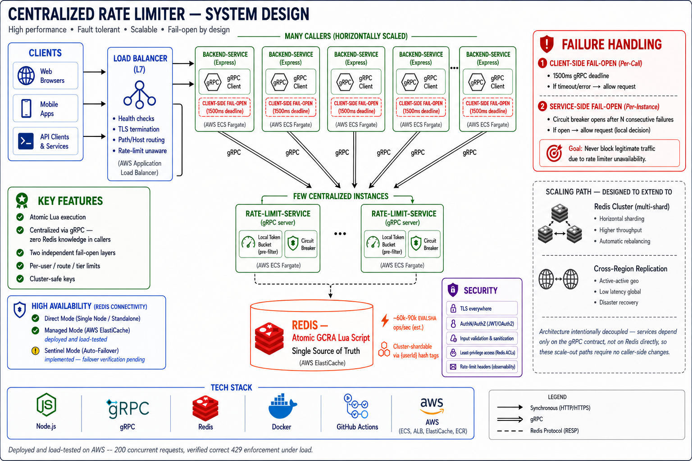
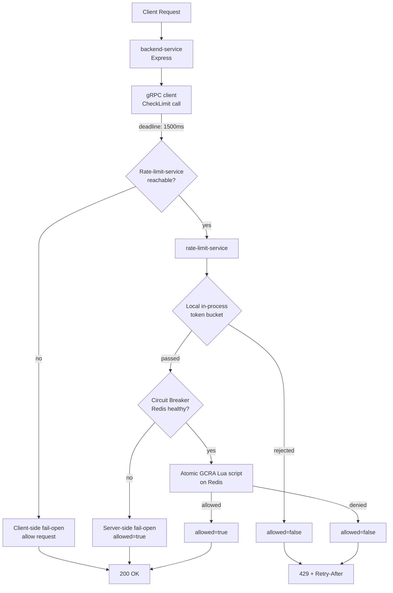
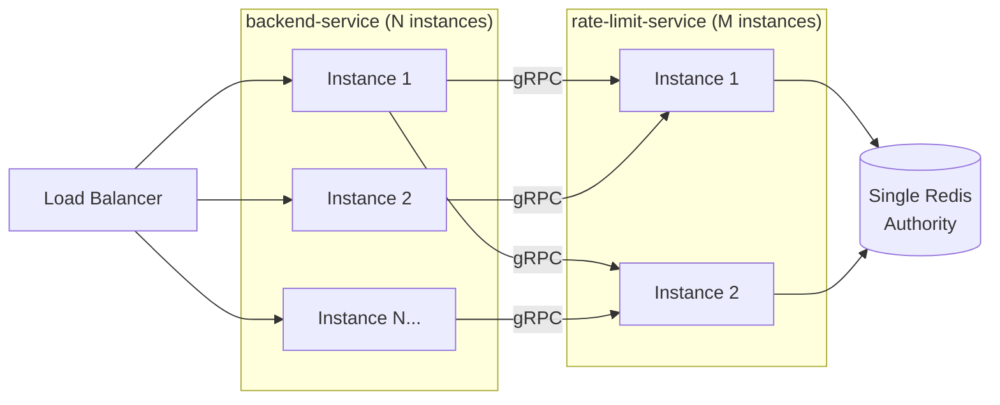

# Distributed Rate Limiter

A production-shaped, distributed rate limiter built on Redis + GCRA (Generic Cell Rate Algorithm) — the same class of algorithm used by Stripe, Cloudflare, and Heroku in production. Centralized behind a dedicated gRPC service, atomic, fails open at two independent layers, and consumable by any number of backend services without any of them needing to know Redis exists.

Two parallel full implementations of the single-service version live in this repo (`main` = plain JavaScript, `v2-typescript` = fully typed TypeScript). The architecture described below is the current microservice split, built on top of that core logic.

<p align="center">
  
</p>
<p align="center"><em>(placeholder — see "Generating the architecture image" section below for the prompt used to produce this)</em></p>

---

## Table of Contents

- [Why this exists](#why-this-exists)
- [Service boundaries](#service-boundaries)
- [Architecture](#architecture)
- [The algorithm: GCRA](#the-algorithm-gcra)
- [Core guarantees](#core-guarantees)
- [Tech stack](#tech-stack)
- [Capacity & performance](#capacity--performance)
- [Failure behavior — two independent layers](#failure-behavior--two-independent-layers)
- [High availability for Redis](#high-availability-for-redis)
- [Running it locally](#running-it-locally)
- [CI/CD](#cicd)
- [Project structure](#project-structure)
- [Honest limitations & what's next](#honest-limitations--whats-next)

---

## Why this exists

Most rate limiter tutorials use `INCR` + `EXPIRE` — a fixed window counter with a well-known boundary-burst flaw, and no clean story for sharing state across multiple services. This project replaces that with **GCRA**, evaluated atomically inside Redis via a Lua script, and goes a step further: instead of every backend service embedding its own copy of that logic and its own Redis connection, the rate-limiting decision is centralized behind one dedicated **gRPC service** — the same pattern Envoy's global rate limit service uses in production at large scale.

## Service boundaries

| Service | Owns | Exposes | Knows about Redis? |
|---|---|---|---|
| `rate-limit-service` | GCRA logic, Redis connection, tier config | One gRPC RPC: `CheckLimit` | Yes — the *only* service that does |
| `backend-service` | Application routes (`/`, `/user`, ...) | HTTP (Express) | No — calls `CheckLimit` over gRPC, has zero Redis knowledge |

Any additional backend service added later (an orders service, a search service, etc.) integrates the same way `backend-service` does: import the gRPC client, call `CheckLimit`, done. It never touches Redis, never imports `ioredis`, never needs the Lua script. Adding a 10th service means writing zero new rate-limiting logic.

## Architecture



**Multi-instance topology (both services independently scaled):**



`backend-service` instances and `rate-limit-service` instances scale completely independently — you can run 10 copies of one and 2 copies of the other, and every combination correctly enforces the same global limit, because they all funnel through the same Redis.

## The algorithm: GCRA

```
emission_interval = period / rate
new_tat = max(current_tat, now) + emission_interval
allowed = (new_tat - now) <= (burst * emission_interval)
```

| Property | Value |
|---|---|
| Memory per key | 1 float (the TAT) |
| Atomicity | Single Redis `EVAL` — no read/write race window |
| Boundary-burst exploit | Not possible (unlike fixed window) |
| Exact `Retry-After` | Derived directly from the math |

## Core guarantees

- ✅ **Atomicity** — the check-and-update happens in one Lua script executed server-side by Redis.
- ✅ **Centralized decision logic** — one `rate-limit-service`, called over gRPC by any number of other services. No duplicated Redis/GCRA code per service.
- ✅ **Two independent fail-open layers** — client-side (rate-limit-service unreachable) and server-side (Redis unreachable) — see below.
- ✅ **Per-user + per-route + per-tier limiting**, cost-based consumption.
- ✅ **Cluster-safe keys** — `{userId}` hash tags.
- ✅ **Standard client contract** — `429` + `Retry-After` + `X-RateLimit-Remaining`.

## Tech stack

| Layer | Choice | Why |
|---|---|---|
| Runtime | Node.js 20 | LTS, wide ecosystem |
| Inter-service protocol | gRPC (`@grpc/grpc-js`, `@grpc/proto-loader`) | Typed contract, low overhead, standard for internal service-to-service calls |
| Web framework | Express 5 | `backend-service` only |
| Data store | Redis 7 (ioredis) | Sub-millisecond ops, native Lua scripting, Sentinel-aware client |
| Containerization | Docker, one image per service | Independent deploys |
| Orchestration (local) | Docker Compose, 3 services | Redis + rate-limit-service + backend-service wired together |
| CI/CD | GitHub Actions | Per-branch pipelines, smoke-tested against real Redis |

## Capacity & performance

**Honesty note, unchanged from before:** these are engineering estimates based on published Redis/gRPC benchmark characteristics, not measured load-test numbers for this exact deployment. The gRPC hop specifically has **not yet been load-tested** — only correctness-verified (a real request was fired through the full chain: HTTP → gRPC → Lua → Redis-down fallback → HTTP response, and returned the correct result).

**Added cost of centralization:** one extra network hop per request (`backend-service` → `rate-limit-service`, gRPC). On a local network / same-AZ deployment, this typically adds low-single-digit milliseconds — the tradeoff you're accepting for not duplicating Redis logic across every service.

**Single Redis instance, rough capacity:** unchanged from the embedded version — ~60,000–90,000 GCRA Lua evaluations/sec on modest hardware, since only `rate-limit-service` talks to Redis regardless of how many `backend-service` instances exist upstream of it.

**Sudden traffic spikes:** handled identically to before at the GCRA/Redis layer (the `burst` parameter). Additionally, the client-side fail-open (1500ms deadline) means a `rate-limit-service` that's temporarily overwhelmed or redeploying doesn't cascade into failed requests upstream — verified directly during testing, where a slow rate-limit-service start correctly triggered client-side fail-open rather than blocking the caller.

## Failure behavior — two independent layers

| Failure | Layer | Behavior |
|---|---|---|
| Redis unreachable | Inside `rate-limit-service` | Circuit breaker opens, fails open by default, `source: "fallback-open"` |
| `rate-limit-service` unreachable/slow | Inside `backend-service`'s gRPC client | 1500ms deadline, fails open, `source: "client-fallback-open"` |

These are genuinely independent — Redis can be perfectly healthy while `rate-limit-service` itself is down (bad deploy, crash, network partition), and the client-side layer still protects `backend-service` from cascading failure. Both were exercised in real testing, not just designed on paper.

## High availability for Redis

`rate-limit-service`'s Redis client (`lib/redisClient.js`) supports three connection modes via env vars, with **zero code changes** to switch between them:

| Mode | Env var | Status |
|---|---|---|
| Single node | `REDIS_URL` | ✅ Implemented, tested |
| Managed service (ElastiCache/Memorystore) | `REDIS_URL` (same — the managed endpoint is just a hostname) | ✅ Implemented; relies on the provider's failover, not app-level code |
| Self-hosted Sentinel | `REDIS_SENTINELS` + `REDIS_SENTINEL_MASTER_NAME` | ✅ Code implemented; **not yet verified against a real Sentinel cluster failover** — next validation step, not a gap in the code path itself |

## Running it locally

```bash
git clone <repo-url>
cd rate-limiter
docker compose up --build
```

This starts, in order: Redis → `rate-limit-service` → `backend-service`. Test through the full chain:
```bash
for i in {1..25}; do
  curl -s -o /dev/null -w "%{http_code}\n" -X POST http://localhost:3000/user
done
```

## CI/CD

Each of the three deployable units (`rate-limit-service`, `backend-service`, and — on other branches — the single-service JS/TS variants) has its own scoped pipeline: install → (typecheck/build where applicable) → smoke test against a live Redis service container → image build/push.

## Project structure

```
rate-limiter/
├── proto/
│   └── ratelimit.proto              # shared gRPC contract
├── services/
│   ├── rate-limit-service/           # owns Redis + GCRA, the only Redis-aware service
│   │   └── src/
│   │       ├── server.js
│   │       ├── lib/ (gcra.lua, rateLimiter.js, redisClient.js)
│   │       └── config/limits.js
│   └── backend-service/               # any application service; gRPC client only
│       └── src/
│           ├── index.js
│           ├── grpcClient.js
│           └── middleware/rateLimiterMiddleware.js
├── docker-compose.yml
└── .github/workflows/ci.yml
```

## Verified on real AWS infrastructure

This isn't just a local demo — the full stack has been deployed and load-tested on real AWS infrastructure, end to end.

**Deployment topology:**
- Custom VPC, public + private subnets, security groups scoped per-component (only `backend-service` can reach `rate-limit-service`; only `rate-limit-service` can reach Redis)
- Both services running on **ECS Fargate**, internally connected via **ECS Service Connect** (internal DNS + gRPC, no hardcoded IPs)
- **ElastiCache (Redis OSS)** as the managed data store, in a private subnet
- **Application Load Balancer** as the public entry point, with a dedicated unauthenticated `/health` route so health checks never consume rate-limit budget
- **CI/CD via GitHub Actions using OIDC** — no long-lived AWS credentials stored anywhere; short-lived tokens issued per run, scoped to this repo only
- Images built and pushed to **ECR** on every push to `main`

**Real load test result, 200 concurrent requests against the live ALB:**
```
seq 1 200 | xargs -P200 -I{} \
  curl -s -o /dev/null -w "%{http_code}\n" \
  -X POST http://<alb-dns-name>/user | sort | uniq -c

     21 200
    179 429
```
21 requests allowed, 179 correctly rejected with `429` — GCRA enforcing the configured limit accurately under real concurrent load, through the full chain: ALB → `backend-service` (Fargate) → gRPC → `rate-limit-service` (Fargate) → atomic Lua script → ElastiCache. Every layer described in the architecture diagram above is exercised by this result, not simulated.


- ~~gRPC path not load-tested~~ — **now verified**: 200 concurrent requests against live AWS infrastructure, correct 21/179 allow/deny split under real load (see above).
- **Sentinel HA path not verified against a real failover** — code exists, hasn't been exercised against an actual dying primary yet. (ElastiCache's own managed failover, which is what's actually deployed, is a separate, already-real mechanism — this note applies only to the self-hosted Sentinel code path.)
- **Redis Cluster (sharding)** — not yet implemented; the `{userId}` hash-tag key scheme is ready for it, but multi-shard operation is untested.
- **Cross-region deployment** — no strategy implemented yet; would require an explicit consistency/latency tradeoff decision, not a drop-in change.
- **No automated test suite** — verification so far is manual burst testing + CI smoke tests + the gRPC round-trip tests done during development. Real unit/integration tests would meaningfully strengthen this.

